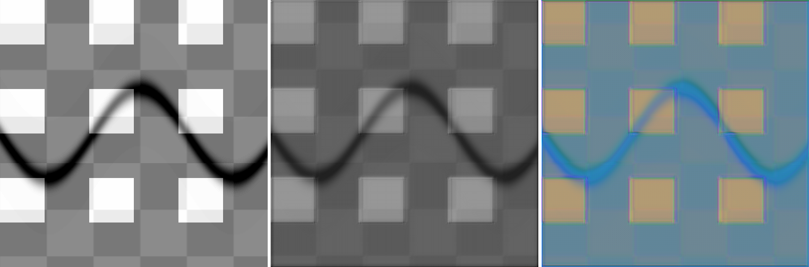
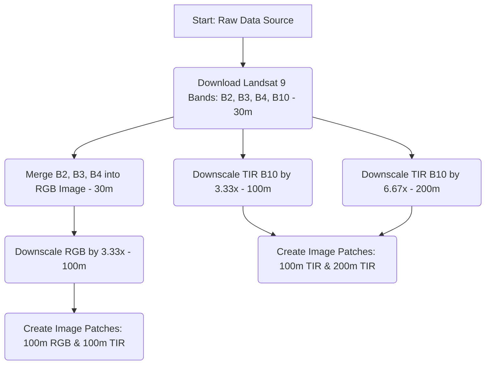

# Infrared Image Colorization and Enhancement for Improved Object Interpretation

## Overview

Thermal Infrared (TIR) data is invaluable for monitoring wildfires, urban heat islands, and volcanic activity. However, raw TIR imagery is typically single-band (grayscale) and lacks the intuitive detail of RGB imagery, making object interpretation difficult for human analysts.

**Project Goal:** Develop a computational pipeline and machine learning model that produces two primary outputs:

1. **A Super-Resolved TIR Image**: Increase the spatial resolution of raw TIR imagery to recover critical structural details.
2. **A Colorized TIR Image**: Synthesize realistic colors for the TIR data, using multi-spectral RGB data as a guide.

### 🖼️ Sample End-to-End Pipeline Output Sequence


*Figure: Side-by-side comparative sequence generated by the trained model pipeline (Left: Raw TIR, Middle: Super-Resolved TIR, Right: Semantic Colorized RGB).*

---

## Data Acquisition

### Data Specifications

On the USGS Earth Explorer site, all Landsat 9 bands (B2, B3, B4, and B10) are registered and provided at a **30m resolution**. However, it is important to note that the original spatial resolution of the TIR band (B10) is **100m**, while the RGB bands (B2, B3, B4) are natively **30m**.

To get started, you will need Landsat 9 imagery.

### Quick Start (Demo Data)

Use the provided bash script to download sample bands into `input/demo_product/`:

```bash
chmod +x scripts/download_data.sh
./scripts/download_data.sh
```

### Custom Downloads (Google Earth Engine)

Use `scripts/download.py` to fetch specific bands using GEE:

```bash
python scripts/download.py <product_id> <bands> <start_date> <end_date> <output_path> --ee_project_id <your_project_id>
```

### Custom Downloads (USGS Earth Explorer)

You may also download data directly from [USGS Earth Explorer](https://earthexplorer.usgs.gov/); please ensure it is placed in the `input` directory following the structure below.

### Required Input Directory Structure

To ensure the baseline scripts function correctly, please organize your data as follows:

```
input/
└── <folder_name>/
    ├── <file_prefix>_B10.TIF
    ├── <file_prefix>_B2.TIF
    ├── <file_prefix>_B3.TIF
    └── <file_prefix>_B4.TIF
```

*Note: While `<folder_name>` can be any identifier of your choice, the files inside must end with the specified band suffixes (`_B10.TIF`, `_B2.TIF`, `_B3.TIF`, `_B4.TIF`) to be correctly processed by the pipeline.*

---

## Baseline Implementation: Dataset Generation

This baseline focuses on the most critical part of the pipeline: **creating co-registered training pairs**.

### Dataset Generation Workflow

Run the driver script to generate multi-resolution, spatially aligned patches:

```bash
python driver.py
```

**Pipeline Details:**

1. **Merge**: Optical bands (B2, B3, B4) are merged into a 30m RGB image.

2. **Downscale**: The baseline takes the 30m resampled USGS data and downscales it to create training pairs:
   - **Input**: All bands are processed from their 30m resampled versions.
   - **Rescaling Factors**:
     - RGB (30m) to 100m (scaled by a factor of 3.33)
     - TIR (30m) to 100m (scaled by a factor of 3.33)
     - TIR (30m) to 200m (scaled by a factor of 6.67)
   - **Data Flow**: For the Super-Resolution task, the TIR band is downsampled to 200m as input, with the objective of recovering a 100m output.

3. **Extract Co-registered Patches**:
   - **SR Pair**: 256x256 (200m TIR) → 512x512 (100m TIR).
   - **Colorization Pair**: 256x256 (100m TIR) → 256x256 (100m RGB).

4. **Save Output**: Both `.npy` (for training) and `.png` (for verification) files are saved in `output/patches/`.
   - ⚠️ **Important**: Do **not** train your models on the `.png` files. `.png` files are intended for visualization purposes only. For training, use the `.npy` files to maintain the original radiometric resolution of the data.

### Technical Alignment

The baseline ensures strict spatial co-registration:

- One pixel in the 200m TIR image corresponds exactly to a 2x2 block in the 100m TIR/RGB images.
- All patches are extracted using the same top-left offset to maintain alignment across resolutions.

---

## Conceptual Workflow

The following diagram illustrates the end-to-end process for dataset generation. These are **suggested approaches**. Alternative workflows can be explored for better structural accuracy, or entirely new pipelines can be designed to achieve the objectives.



---

## Expected Pipeline and Output Format

Following the dataset generation, a multi-stage model pipeline should be implemented.

**Inference Flow:**

For the entire pipeline during inference, the input will be the **200m resolution TIR band (B10)**. The pipeline is expected to produce two outputs:

1. **Super-Resolution Stage**: Develop a model to generate high-resolution (100m) TIR images from the low-resolution (200m) inputs.
2. **Colorization Stage**: Pass the resulting high-resolution TIR images into a colorization model to produce synthetic, interpretable RGB representations.

### Mandatory Output Structure

To ensure standardized evaluation, the final output must be organized in the `output/` directory as follows:

```
output/
└── model_outputs/
    ├── tir_superresolved_100m/
    │   └── <product_id>.tif
    └── colorized_tir_100m/
        └── <product_id>.tif
```

*Note: `<product_id>` must exactly match the original input product ID.*

**Band Ordering Requirement:**

For the colorized TIR images, the output TIFF must adhere to the following channel sequence:

- **Layer 1**: Blue
- **Layer 2**: Green
- **Layer 3**: Red
